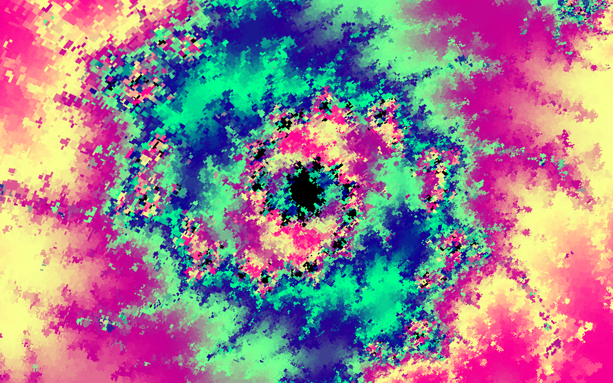

# Julia set Explorer

This project allows for the realtime exploration of Julia sets.
If you are in need of a screensaver, look no further, there are plenty to find here.

Try it yourself: [click me](http://yesno.wtf)

# Table of contents

[Gallery](#gallery)

[What am I even looking at? - Mandelbrot and Julia](#mandelbrot-and-julia)

[Parameters](#parameters)

&nbsp;&nbsp;[Julia Coordinates ($c$ value of the Julia set)](#julia-coordinates--value-of-the-julia-set)

&nbsp;&nbsp;[Escape Radius](#escape-radius)

&nbsp;&nbsp;[Exponent](#exponent)

&nbsp;&nbsp;[Number of Iterations](#number-of-iterations)

&nbsp;&nbsp;[Color](#color)

[Double precision using CPU Rendering](#double-precision-using-cpu-rendering)

&nbsp;&nbsp;[Avoiding pixelation with CPU rendering](#avoiding-pixelation-with-cpu-rendering)

## Gallery

## Mandelbrot and Julia

### The Mandelbrot set

If you are already familiar with the Mandelbrot set, you may skip this section and jump ahead to the [next one](#julia-sets).

At the basis of this entire project lies one uncomplicated formula: $$z_{n+1}=z_n^2+c$$
where both $z$ and $c$ are complex numbers.
The Mandelbrot set consists of all complex points $c=x+iy$ for which the above sequence starting with $z_0=0$ does not diverge to infinity for $n\rightarrow\infty$.
All of the points contained in the Mandelbrot set are colored black. The coloring of the other points follows some arbitrary coloring function, usually based on the "time" it takes the series to "diverge to infinity" based on the particular point $c$.

### Julia sets

Julia sets are defined using the same sequence of complex numbers as the Mandelbrot set:
$$z_{n+1}=z_n²+c$$
The only difference is that instead of asking for which $c$ the series diverges to infinity starting at $z_0=0$, we instead fixate the $c$ and ask for which starting points $z_0=x+iy$ the series diverges to infinity.

# Controls

A brief overview of the available shortcuts and what they do.
[TODO]

## Saving Images

All generated Julia sets can be downloaded in PNG-format in arbitrary resolution (in practice, your browser probably won't like allocating a gigabyte of memory for a single tab so maybe don't go beyond the limits).

In order to save an image, click on the corresponding button or press the "s"-key on your keyboard. This will open a preview in which you can adjust the center of the image, the zoom, the resolution, and turn on [CPU rendering](#avoiding-pixelation-with-cpu-rendering).

You can start rendering the final image by pressing the associated button. Once the image has been rendered, it will be downloaded.

If you are making use of CPU rendering this will take some time. A progress bar and an estimate of the remaining time will act as indicators.
If you don't use CPU rendering (which is advised if it's not necessary) the render should, under most circumstances, finish after no longer than a couple of seconds at most and usually be perceived as instantaneous.

By default the resolution should be set to match the resolution of your monitor. If that's not the case or you would like to change the resolution of the downloaded image for some other reason, you can do so by entering the values into the corresponding inputs. The preview will automatically try to adjust to display the correct aspect ratio. If the preview gets too small, it will try to resize itself to take up more space. However, it will only try to do so when the preview can fit on the screen. If the aspect ratio is very out of the ordinary (i.e. something like 50:1) it is very likely that the preview will extend beyond the bounds of the screen and not adjust its size.
Note that changing the resolution will also not affect the quality of the image in the preview, meaning that there will be no visual difference between the preview of an image with resolution 3072x1920 (aspect ratio 16:10) and that of an image with a resolution of 1920x1200 (16:10 as well). The resulting image will of course be rendered in the desired resolution.

# Parameters

The following parameters can be adjusted to tweak the resulting image's appearance:

-   [Julia Coordinates ($c$ value of the Julia set)](#julia-coordinates--value-of-the-julia-set)
-   [Escape Radius](#escape-radius)
-   [Exponent](#exponent)
-   [Number of Iterations](#number-of-iterations)
-   [Color](#color)

### Julia Coordinates ($c$ value of the Julia set)

The Julia Coordinates determine the general shape of the Julia set. They can be adjusted by moving the mouse over the Mandelbrot set (if nothing happens, try pressing "f" to make the indicator follow the mouse; Look [here]() for more information about the controls) or entering the values in the corresponding input-fields.

|                                            Julia Coordinates of about(0.3159,-0.0421)                                            |                                          Julia Coordinates of about (-1.4808,0.0014)                                           |
| :------------------------------------------------------------------------------------------------------------------------------: | :----------------------------------------------------------------------------------------------------------------------------: |
|  |  |

### Escape Radius

In order to check whether the aforementioned series diverges to infinity for a given point, we have to define a threshold value after which we "cut it off" since the range of 32 or even 64 bit numbers does not quite extend to actual infinity.

Though a bit niche, the value of this parameter can have a significant effect on the look of the image:

|                                                 Escape Radius of 1.1                                                 |                                                 Escape Radius of 100                                                 |
| :------------------------------------------------------------------------------------------------------------------: | :------------------------------------------------------------------------------------------------------------------: |
|  |  |

## Exponent

The exponent (very informally) decides "the number of branches". Non-Integer values are allowed.

|                                                Exponent of 2                                                |                                                       Exponent of 3                                                       |
| :---------------------------------------------------------------------------------------------------------: | :-----------------------------------------------------------------------------------------------------------------------: |
|  |  |

(Note that in these images not just the exponent was changed; Since the topology changes, the resulting images in the same position would not look similar. To emphasize the idea behind the exponent the position of the Julia Coordinates has been adjusted between the images)

## Number of Iterations

The accuracy with which the fractals are rendered depends not only on the escape radius but also on the number of iterations (i.e. the maximum value of $n$ in the aforementioned formula). Depending on the desired style adjusting the number of iterations can make a big difference on how "detailed" the resulting render is going to be:

|                                                      nrIterations of 100                                                       |                                                      nrIterations of 1000                                                       |
| :----------------------------------------------------------------------------------------------------------------------------: | :-----------------------------------------------------------------------------------------------------------------------------: |
|  |  |

Naturally, increasing the number of iterations will come with the price of decreased performance, though solely for rendering single frames even iteration counts in the thousands are considerably fast.

## Color

### Smooth Coloring

Despite being able to select the color used for rendering the image, there are certain functions one can apply:

When using linear coloring methods (Static Orange or Linear RGB) bands of color will appear because of the way the colors are calculated with the escape radius (it essentially boils down to the color values being integers). This can have its own asthetic, however, by enabling Smooth Coloring these bands of color should be (mostly) eliminated (the bands in this image are not that noticeable):

|                                                         Smooth Coloring off                                                          |                                                           Smooth Coloring on                                                            |
| :----------------------------------------------------------------------------------------------------------------------------------: | :-------------------------------------------------------------------------------------------------------------------------------------: |
|  |  |

### Static Orange and Linear RGB

Linear RGB is essentially taking the color value provided via the color picker and directly using it to render the fractal without modifying it any further.

|                                                 Linear RGB with value (26,117,0)                                                 |                                               Linear RGB with value (26,11,176)                                                |
| :------------------------------------------------------------------------------------------------------------------------------: | :----------------------------------------------------------------------------------------------------------------------------: |
|  |  |

### Static Orange

Static Orange does not take into account the color value provided but instead is just a static color (orange). The reason this has been included as its own option is simply because I think it looks awesome.

| Static Orange |
| :-----------------------------------------------------------------------------------------------------------------------------------:
| 

### Nonlinear 1 and 2

Of course there are other ways to compose a color than just taking the input provided by the user and rendering directly from that. Both Nonlinear 1 and 2 take the input color into consideration, but transform it in a nonlinear fashion. That is, don't expect the resulting image to be red simply because you input a red color.

There are of course infinite possibilities when it comes to combining and tinkering with these color values, but for now I have settled on these two. Note that Nonlinear 2 is somewhat special in that it's quite hard to get images which are not completely over the top. It should be considered as more of on "experimental" setting. Choosing color values closer to zero makes both Nonlinear 1 and 2 a bit easier to work with.

|                                               Nonlinear 1 with value (17,39,33)                                                |                                               Nonlinear 2 with value (0,23,31)                                                |
| :----------------------------------------------------------------------------------------------------------------------------: | :---------------------------------------------------------------------------------------------------------------------------: |
|  |  |

Note that because of the nonlinearity, enabling Smooth Coloring will not have an effect on Nonlinear 1 and 2.

## Double precision using CPU rendering

By default WebGL uses 32 bit floating numbers (single precision). For the majority of use cases this will be plenty, however, when dealing with fractals it imposes a firm limit on how far one can zoom into the fractals before things start to get very pixelated.

Take a look at the following image, zoomed to a magnification of ~1183 compared to the initial display:

As you can see, it would probably not quite be categorized as "sharp". Note that this is not a problem with the implementation itself; It is an issue arising solely from a lack of precision.
Therefore this _can_ be mitigated by increasing the precision. The following image has been rendered using the exact same algorithms, the only difference being the employment of double precision:

There is a problem, though: WebGL does not natively support double precision. Claiming this to be an insurmountable obstacle would of course be an exaggeration: Naturally, there are ways to emulate double precision in WebGL, but this turns out to be a rather complicated endeavor which I, after some experimentation, for now have deemed to not be worth the effort - especially since we not only need the extra precision but the range as well.

The current (and cognitively cheap) solution is to make use of the fact that any number in JavaScript will be stored using 64 bit, meaning rendering on the CPU will provide us with an abundance of precision. Well, "abundance" in the sense that you will be less likely to be running into precision issues than others. Namely, under these new circumstances, the main concern becomes the performance, e.g. the time it takes to render a single frame on the CPU.

Here's where things start to become ugly. While even my integrated GPU will happily render at an at least somewhat useable frame rate under reasonable conditions, the CPU (which, remember, does not have access to thousand of cores running in parallel) will take its time and render at a steady <1 FPS. Admittedly, this might still be considered as misleading marketing, as the actual frame rate on my particular machine (AMD Ryzen 7 6800HS Creator Edition) for an image of resolution 3072x1920 will be anywhere in the range from around $0.05=\frac{1}{20}$ to about $0.0025=\frac{1}{400}$ FPS, with even longer rendering times being very possible. This means that in practice I will be waiting anywhere from 20 seconds to multiple minutes for a CPU rendering to complete.

### Avoiding pixelation with CPU rendering

To enhance the precision and therefore avoid possibe pixelation of the image when zooming in far, turn on CPU rendering by pressing the associated button in the download preview.
Turning CPU rendering on will render the current preview on the CPU **which will take some time**. A small progress bar acts as an indicator. Once you have turned CPU rendering on, simply press the download button to start rendering the final image. This will take **a very long time, not unlikely multiple minutes**.

Enabling CPU rendering will not stop you from interacting with the canvas as usual, but keep in mind that this is **tremendously slow** and if you are not running on NASA-level hardware you should probably refrain from trying to actually use this for realtime interaction.

Instead, **only activate CPU rendering when you want to download the currently displayed image**. If you have to make any adjustments other than simply centering a certain point (double clicking any point on the canvas will center it and result in only one frame being rendered) you are probably better off just turning the CPU rendering off, making your changes, turning it on again and then downloading your image.
